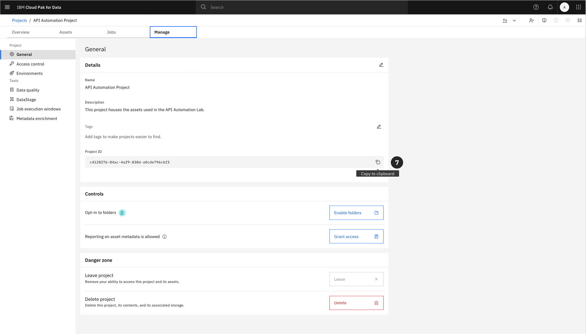
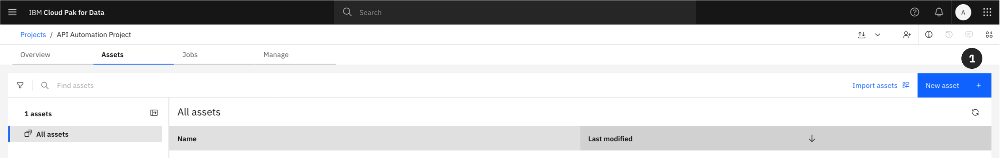

# Automating watsonx.data intelligence with the Watson Data API

## Introduction

Congratulations on reaching the final lab in our watsonx.data intelligence course! Throughout this program, you have gained hands-on experience with the entire data intelligence lifecycle. You’ve manually established governance policies by creating a business glossary, connected to diverse data sources, executed metadata imports to understand your data landscape, and run data profiling and enrichment to improve data quality and business context. Finally, you learned how to publish those trusted, high-quality assets to the catalog for broader consumption.

While performing these tasks manually is crucial for understanding the foundational concepts, it is not a scalable approach for enterprise operations. The true value of a data fabric is realized when these workflows are made repeatable, consistent, and efficient through automation. This is where the Watson Data API becomes indispensable.

At its core, the **Watson Data API** is a powerful REST API that provides programmatic control over the features and functions within Cloud Pak for Data. It is the engine that allows you to orchestrate complex data management, governance, and analytics workflows using code. In this capstone lab, we will use a Jupyter Notebook to call this API and automate the entire end-to-end process you previously performed by hand.

Once you complete the initial setup outlined in this guide, the Jupyter Notebook will walk you through the following automated sequence:

1.  **Configure and Authenticate:** The first step within the notebook is to configure your environment variables. This provides the script with the necessary credentials and endpoints to initialize the import client and securely authenticate with the watsonx.data platform.

2.  **Establish the Business Glossary:** With authentication confirmed, you will import a set of governance artifacts from a `.zip` file. This single API call will programmatically create the business terms and categories that serve as the blueprint for your governance framework.

3.  **Connect to Data Sources:** Next, you will create connections to three distinct enterprise data sources: **IBM Cloud Object Storage**, **IBM Db2 Warehouse**, and **PostgreSQL**. This step automates the process of registering these sources with your project, making their assets available for discovery.

4.  **Execute a Metadata Import:** With connections established, you will run a metadata import. This process scans the connected data sources and brings the technical metadata for all relevant tables and files into your project, giving you a comprehensive view of your data assets.

5.  **Perform Metadata Enrichment:** This is where raw metadata is transformed into trusted, business-ready data. The script will automatically assign business terms, data classes, and other governance artifacts to the imported assets, mirroring the manual enrichment process you performed earlier but executed in seconds via an API call.

6.  **Publish to the Catalog:** The final step in the automation workflow is to publish the newly connected and enriched data assets to the **Automation** catalog. This makes your high-quality, governed data discoverable and available for use across the enterprise.

This lab serves to bridge the gap between manual understanding and operational efficiency. Let's begin by setting up the environment required to run this powerful automation.

---

### Log in to the OpenShift Console
---
Follow the instructions in this step to locate the **Redhat OpenShift** console URL and credentials to log in to the **RedHat OpenShift** environment that has been successfully provisioned and that TechZone has provided a **notification email** informing you that the reservation for the environment is **Ready**. These instructions will also show how to monitor the installation of **Cloud Pak for Data** and how to locate the **Cloud Pak for Data** console route (URL) and credentials to log in to the **Cloud Pak for Data** console.

Check the email account associated with your **TechZone** account and look for an email with the subject: **[EXTERNAL] Reservation Transferred on IBM Technology Zone** with a Status: **Ready**. This is a TechZone **pre-warmed** environment so the email says it was **Transferred** because the environment was transferred from the **pre-warmed** pool of ready environments. It will look similar to the screenshot below.

> If you use the Microsoft Outlook web client for email, the email might be placed in the **Other** tab in your inbox so make sure you check the **Other** tab if you don't see it in the **Focused** tab. Make note of the **Reservation Name** because there may be multiple reservations in your TechZone account. Your reservation name may be different from the name depicted in the screenshot below if you chose to change the name of the reservation in the previous step.


---

> **Keep this tab open in your browser**. You will be instructed to come back to this tab to retrieve the **Bastion** SSH Connection URL, Username, and Password to **SSH** (Secure Shell) into the **Bastion** node for this environment in the [Apply Data Intelligence Patch](#apply-data-intelligence-patch) step at the end of this lab.

3. Click the **copy** button next to the password field to copy the **kubeadmin** password to the clipboard.
4. Click the **Open your OCP-V on IBM Cloud environment** button.


---

5. Click the **kube:admin** button to Login as the **kubeadmin** user.


---

6. Enter **kubeadmin** for the Username.
7. Paste the **password** that was copied to the clipboard in the previous step into the Password field.
8. Click the **Log in** button.


---

> **Keep this tab open in your browser**. You will be instructed to come back to this tab to retrieve the **OC Login Token** to login to the cluster as the cluster administrator in the [Apply Data Intelligence Patch](#apply-data-intelligence-patch) step at the end of this lab.

Upon entering the console, there will be a **Notification** bat at the top of the page indicating the status of the **Cloud Pak Deployer** Pipeline run and the environment:

A **Green** message bar that reads: **'Pipeline configure-deployer ran successfully. Please check the logs to view the login details. <u>here</u>'** means the environment is ready for use and the log will contain the **Cloud Pak for Data** URL and admin password.


> This is the state that is expected and will almost always be the case with a few exceptions, as noted below.

---

A **Red** message bar that reads: **'Pipeline failed configure-deployer. Please try and rerun the pipeline by clicked Action -> Rerun. <u>here</u>'** means the **Cloud Pak Deployer** encountered a problem or the **Cloud Pak for Data** installation failed and the log will contain the error messages and reason for failure.


<Warning>
This is a very unlikely scenario because all the environments are pre-warmed environments that are continuously validated. If TechZone finds a failed environment in the queue, the system deletes it and re-creates a new one in the queue. If the environment has a **Red** banner indicating it has failed, the best course of action is to delete the reservation and request a new one from the queue.
</Warning>

---

A **Blue** message bar that reads: **'cloud-pak-deployer-5.1.x is still running. Please check the status <u>here</u>'** means the **Cloud Pak for Data** installation is still in progress and the environment is not ready for use so you will need to come back when it is completed.


> This is a likely scenario because even though all the environments are pre-warmed environments, when the pre-warmed pool has expired because it has not been used very often or the pool is heavily used and has been depleted. When this happens the next environment reserved happens to be the first environment in the pool and that environment has to be created before the pool is replenished.

In any case, **Do not** click on the **<u>here</u>** link on the message bar. Instead of clicking on the **<u>here</u>** link, which is only provided for **Cloud Pak Deployer** OCP-V clusters, and will open up yet another tab in your browser, the instructions below provide a different method that will show technical sellers how to navigate the **Redhat OpenShift** console to get to the **Cloud Pak Deployer** Pipeline to view the log.

9. From the left side menu, click the **Pipelines** menu to open it, and select the **Pipelines** sub-menu.


---

10. Click the **PipelineRuns** tab.
11. Click the **configure-deployer** pipeline run (there should only be one Pipeline run in the list).


---

12. Click the **Logs** tab.


On the left side of the logs tab, the log is broken down into sections that convey the different steps that the **Cloud Pak Deployer** executed to install **IBM Software Hub** and all the **Cloud Pak for Data** services.

> The following screenshot is informational for environments that have a **Blue** status banner. Upon entering the log tab you might be taken to the **run-cloud-pak-deployer** section of the log (the current step that is being executed) with a long list of **Waiting for job to be Complete.** messages displayed and the **run-cloud-pak-deployer** menu items depicting a series of blue dots indicating the deployer is still running. This means **Cloud Pak Deployer** is still running and **Cloud Pak for Data** is not fully installed and that the environment is **not ready**.


This is **very unlikely** because these environments are TechZone **pre-warmed** environments. However, as mentioned previously, it can happen occasionally if the pre-warmed environment pool has expired because it has not been used very often or the pool is heavily used and has been depleted. In which case, you will have to wait until the **Cloud Pak for Data** and the **watsonx.data intelligence** services for the environment are fully installed and ready and the banner status turns to **Green**.

---

When the environment is fully ready, the log will look like the screen shot below. When all the log menus have a **green check mark** and you see the **update-configmap-success** log step (the very last step in the log menu) with a green check mark next to it, and it contains the **Cloud Pak for Data** Console Route, Username, and Password, the **Cloud Pak for Data** installation is complete!

13. Select the the **Password**, right mouse click, and select **Copy**. This will copy the password to the clipboard.
14. Select the **Console Route**, right mouse click, and select **Open link in new tab**. This will open the **Cloud Pak for Data** console in a new tab in the browser.


### Log in to Cloud Pak for Data
---
You should be now be in the new tab that was just opened from the **Redhat OpenShift** console with the **Cloud Pak for Data** console ready to log in. You will log in using the **admin** user and password you just obtained from the pipeline in the Redhat OpenShift console.

1. Enter **admin** for the Username.
2. Paste the **password** you copied to the clipboard in the previous step into the Password field.
3. Click the **Continue** button.


---

You should now be logged in as **admin** with a **Welcome to the Administration Console, admin!** message within the **IBM Software Hub** perspective.


4. From the main Software Hub, use the application switcher icon (top left).

5. Once the dropdown opens select **Cloud Pak for Data** to navigate to the home page.


---

## Environment Preparation

A properly configured environment is essential. This section will guide you through creating a new catalog to store data assets and a project to serve as your workspace.

### Create the Automation Catalog

The first step is to create a catalog. A catalog acts as a centralized, governed repository where data assets are organized and managed.

1.  From the Cloud Pak for Data navigation menu (**☰**), select **Catalogs -> All Catalogs**.


2.  Click the **New catalog** button in the upper-right corner.


3.  Give the catalog a **Name**, or copy and paste:

```
Automation
``` 

4. You may add an optional description. 

5. Click **Create** to provision the catalog.


> For this lab, you can leave the rest of the settings as the defaults. 

6.  The **Automation** catalog will now appear in your list of available catalogs. Return to the main dashboard by clicking the **IBM Cloud Pak for Data** in the upper left hand corner.


### Create the Automation Project

Next, you will create a project. Projects are collaborative workspaces in watsonx where you can analyze data and build assets like notebooks and models.

1.  From the navigation menu (**☰**), select **Projects -> All projects**.


2.  Click **New project +**.


3.  Next you will need to define the project details, **Copy** and **Paste** into the **Name:** 

```
API Automation Project
```

4. You may add an optional description, **Copy** and **Paste** into the **Description:** 

```
This project houses the assets used in the API Automation Lab.
```

5. Click **Create**.


---

### Retrieving the Project ID

The Jupyter Notebook requires the unique identifier for your project to interact with it via the API. This Project ID must be copied now for use later in the lab.

6.  Within your newly created project, navigate to the **Manage** tab.


7.  Under the **General -> Details** section, locate the **Project ID**. Click the copy icon to copy the ID to your clipboard and save it for a later step.



---

## Importing the Lab Notebook

The core of this lab is a pre-configured Jupyter Notebook hosted on [GitHub](https://github.com/taylorsegell/L4-Deploy/blob/main/Lab/API%20Automation%20with%20CPD.ipynb). You will now import this notebook into your project. 

There are two primary ways to begin this process, depending on which tab you are on within your project. 

> Select the appropriate option from below depending on where you are in Cloud Pak for Data project. 

### Option 1: From the Assets Tab
1. From within your project, click on the **Assets** tab.  
2. Click the **New asset +** button.  
     
3. From the asset selection grid, locate the "Code editors" section.  
     
4. Select the **Jupyter notebook editor** tile.  
   

### Option 2: From the Overview Tab
1. From the project's main **Overview** tab, locate the tile section and click on **Jupyter notebook editor**.  
   


### Configure the Notebook Import

Both paths will bring you to the **Create a notebook** screen. From here, complete the following steps to import the notebook from its URL.

1.  Select the **URL** tab in the lefthand sidebar.
2.  **Copy** and **Paste** the following into the **Name** field:

```
API Automation Lab
```

3.  **Copy** and **Paste** the GitHub URL below into the **Notebook URL** field:

```
https://raw.githubusercontent.com/taylorsegell/L4-Deploy/refs/heads/main/Lab/API%20Automation%20with%20CPD.ipynb
```
4. Enter an optional **Description**

5.  Click **Create**.


The final setup step is to launch the notebook you have just imported.

6.  Locate the notebook in your project's asset list. To open the notebook and begin the hands-on portion of the lab, click the **edit (pencil) icon**.


> **Important:** This concludes the environment setup. The subsequent steps of the lab are to be completed within the Jupyter Notebook you have just opened.


> Ensure that you keep this page open though because in the appendix you will find environment variables needed throughout the lab. 

---

## Appendix: Environment Variable Configuration (`.env` file)

### Overview

Before executing the code in the Jupyter Notebook, you must configure your environment variables. An `.env` file is a text file used to store key-value pairs representing configuration variables such as credentials, hostnames, and other parameters required for the script to run.

### Purpose

Utilizing an `.env` file is a standard practice for several reasons:
*   **Security:** It externalizes sensitive information like passwords and API keys from your source code, preventing them from being exposed in version control.
*   **Portability:** It allows the same code to be run in different environments (development, testing, production) simply by changing the `.env` file, without any code modifications.

### Configuration

You will need to create a file named `.env` within your project environment. Copy the contents below into this file and populate the values specific to your environment. The `PROJECT_ID` is the value you copied in Section 3.

```bash
# Cluster Info
CPD_CLUSTER_HOST="{THE CPD URL - NO https:// or anything after .com}"
PROJECT_ID="YOUR_PROJECT_ID_HERE" # Paste the Project ID you copied earlier

# User Information
USERNAME="admin"
PASSWORD="adminuser"

# Landing Zone Information
CATALOG_NAME="Automation"

# PostgreSQL Warehouse Credentials
PSQL_DB_USERNAME="cpdemo"
PSQL_DB_PASSWORD="C!oudP@k4DataDem0s"
PSQL_DB_PORT="31128"
PSQL_DB_DATABASE="3RDPARTY"
PSQL_DB_HOST="85331fa6-6b56-4355-935e-290f3ac8aa8c.8117147f814b4b2ea643610826cd2046.databases.appdomain.cloud"
PSQL_DATASOURCE_TYPE="048ed1bf-516c-46f0-ae90-fa3349d8bc1c"

# DB2 Warehouse Credentials
DB_USERNAME="cpdemo"
DB_PASSWORD="C!oudP@k4DataDem0s"
DB_PORT="50001"
DB_DATABASE="BLUDB"
DB_HOST="db2w-ovqfeqq.us-south.db2w.cloud.ibm.com"
DB2_DATASOURCE_TYPE="cfdcb449-1204-44ba-baa6-9a8a878e6aa7"

# Cloud Object Storage Credentials
COS_BUCKET="cpd-outcomes"
COS_SECRET_KEY="6f3fafc225b2c8527f22d13e2c67034f4da989dc08adffac"
COS_API_KEY="_-W6DMVd3cQV7YrWIdmExhX29ApoDIBAu4y0C07dCMPB"
COS_ACCESS_KEY="bd3d4829929a41ac8a2e8e7ab58e5cdb"
COS_RESOURCE_INSTANCE_ID="crn:v1:bluemix:public:cloud-object-storage:global:a/feb0a088323a45db90b8dd694b314c53:88ee55e3-fc61-46a9-9ccd-e81593585ba6::"
COS_DATASOURCE_TYPE="193a97c1-4475-4a19-b90c-295c4fdc6517"

ORIGIN_COUNTRY="us"
```